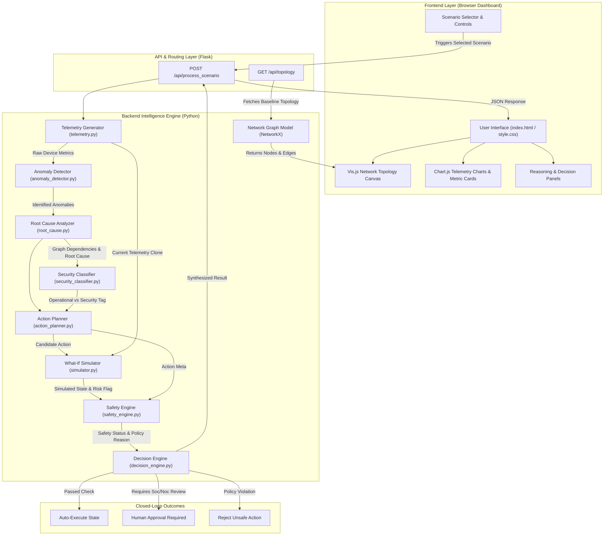

# Intelligent Network Operations System (NetOps-AI)

An autonomous, closed-loop network operation and incident management platform designed for enterprise network reliability and safety verification.

The platform implements a complete 6-stage lifecycle for network telemetry analysis and automated remediation:

$$\text{Detect} \longrightarrow \text{Understand} \longrightarrow \text{Plan} \longrightarrow \text{Evaluate} \longrightarrow \text{Simulate} \longrightarrow \text{Safely Respond}$$

---

## Key Features

- **Graph-Based Topology Engine**: Uses NetworkX directed graphs to model physical network devices, traffic direction, capacity limits, and dependency chains.
- **Explainable Anomaly Detection**: Evaluates telemetry streams (CPU, latency, packet loss, bandwidth) against operational baselines without opaque ML "black boxes."
- **Root Cause Analysis (RCA)**: Distinguishes between downstream symptoms and original failure points using graph traversal algorithms.
- **Operational vs. Security Classification**: Differentiates standard infrastructure failures from potential security threats (e.g., data exfiltration vs. scheduled backups).
- **Digital Twin What-If Simulator**: Clones the active network state and simulates the effect of proposed fixes before executing them in production.
- **Safety Policy & Decision Engine**: Evaluates safety constraints to decide whether an action should be **AUTO-EXECUTED**, require **HUMAN APPROVAL**, or be **REJECTED**.

---

## Directory Structure

```text
netops-ai/
│
├── backend/
│   ├── app.py                      # Flask API Server & Lifecycle Controller
│   ├── network_model.py            # Graph Topology & Dependency Engine (NetworkX)
│   ├── telemetry.py                # Telemetry Stream Generator
│   ├── anomaly_detector.py         # Rule-Based Anomaly Detection Logic
│   ├── root_cause.py               # Dependency-Aware Root Cause Engine
│   ├── security_classifier.py      # Event Security & Intent Classifier
│   ├── action_planner.py           # Remediation Strategy Generator
│   ├── safety_engine.py            # Safety Rules & Policy Validator
│   ├── simulator.py                # Digital Twin What-If Simulation Engine
│   └── decision_engine.py          # Decision Synthesis Engine
│
├── frontend/
│   ├── index.html                  # Dashboard Layout
│   ├── style.css                   # Enterprise Cisco Dark Theme
│   └── script.js                   # Topology Rendering & API Communication
│
├── data/
│   └── scenarios.json              # Incident Simulation Scenarios
│
├── requirements.txt                # Python Dependencies
└── README.md                       # Project Documentation & Guide
```

---

## System Architecture


---

## 🚀 Setup & Execution Instructions

This section provides instructions for running the Intelligent Network Operations System (NetOps-AI) using either the live cloud deployment or a local development environment.

🌐 Live Cloud Execution (Render)

The NetOps-AI platform is fully deployed and can be accessed directly through a web browser without requiring any local installation or configuration.

Live Application URL: https://netops-ai-z203.onrender.com/

Environment: Python 3.10+ WSGI container using Gunicorn

Supported Browsers: Google Chrome, Mozilla Firefox, Microsoft Edge, and Safari

Quick Start

1. Open the "Live Application" (https://netops-ai-z203.onrender.com/) in a modern web browser.
2. The interactive network topology and baseline telemetry dashboard will load automatically.
3. Select an operational scenario from the scenario selector.
4. Click "Inject Scenario & Execute Pipeline" to initiate the incident processing pipeline.
5. Observe the system as it processes the selected scenario through its six-stage closed-loop pipeline.
6. Review the detected issue, root cause, proposed remediation, simulation result, safety decision, and final system state displayed on the dashboard.

💻 Local Setup

The application can also be executed locally for development, testing, or evaluation.

Prerequisites

Ensure the following are installed on your system:

- Python 3.8 or higher
- Git
- pip (Python package installer, included with Python)

Step 1: Clone the Repository

Open a terminal or command prompt and clone the project repository:

git clone https://github.com/sddagrawal/NetOps-AI.git
cd NetOps-AI

Step 2: Create a Virtual Environment

Creating a virtual environment keeps the project's Python dependencies isolated from other applications.

Windows:

python -m venv venv
venv\Scripts\activate

Linux / macOS:

python3 -m venv venv
source venv/bin/activate

Step 3: Install Dependencies

Upgrade pip and install all dependencies specified in "requirements.txt":

pip install --upgrade pip
pip install -r requirements.txt

Step 4: Start the Application

Start the Flask backend using:

python backend/app.py

Once the server starts successfully, the application will be available locally.

Step 5: Access the Local Application

Open a web browser and navigate to:

http://localhost:5000

The NetOps-AI dashboard should now be accessible locally.

---

## 🧪 Testing

Detailed test cases, simulation results, final decisions, and expected system behavior are documented separately in ""tests/test-cases.md"" (tests/test-cases.md).

The test documentation covers normal network operation, device failures, core-router overload, cascading congestion, potential security events, legitimate traffic surges, unsafe remediation, human-approval scenarios, and successful safe remediation.

---

## 📊 Project Presentation

[View Project Presentation](https://1drv.ms/p/c/2C2FE632633AA86F/IQAEaqf8OE3sSL6jxqyfVqD6AWbsDBqncUQNTo2-_jcPUaQ?e=viRqOf)
